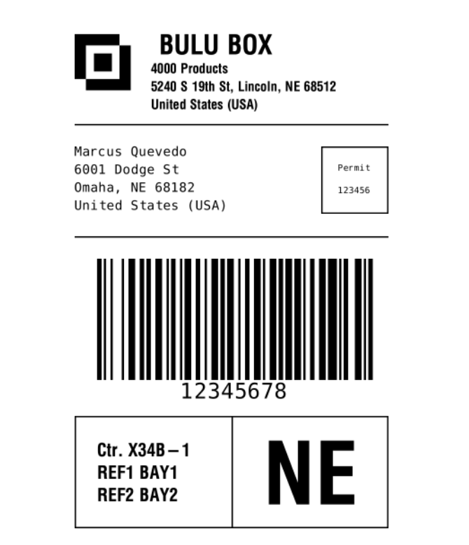

# Zebra programming Language 

**What is ZPL (Zebra programming Language)?**

It is the command based programming language used by the printers as instructions to create the images printed on the labels.

**Why is the ZPL (Zebra programming Language important)?**

This specific program allows us to create barcodes , text and number code with ZPL 
Zebra programming Language extension is .ZPL

**How does ZPl (Zebra programming Language work) ?**

* Here are some examples to practice and get familiar with ZPl (Zebra programming Language work): **http://labelary.com/viewer.html**
* ZPL official manual guide: **https://www.zebra.com/content/dam/zebra_new_ia/en-us/manuals/printers/common/programming/zpl-zbi2-pm-en.pdf**

------------------------------------------------------

**Code Example**

^XA Code Begins  
^FX Top section with logo, name and address. 
^CF0,60 
^FO50,50^GB100,100,100^FS 
^FO75,75^FR^GB100,100,100^FS 
^FO93,93^GB40,40,40^FS 
^FO220,50^FD BULU BOX^FS 
^CF0,30 
^FO220,115^FD4000 Products^FS  
^FO220,155^FD5240 S 19th St, Lincoln, NE 68512^FS 
^FO220,195^FDUnited States (USA)^FS  
^FO50,250^GB700,3,3^FS  

^FX Second section with recipient address and permit information. 
^CFA,30  
^FO50,300^FDMarcus Quevedo^FS  
^FO50,340^FD6001 Dodge St^FS  
^FO50,380^FDOmaha, NE 68182^FS  
^FO50,420^FDUnited States (USA)^FS  
^CFA,15  
^FO600,300^GB150,150,3^FS  
^FO638,340^FDPermit^FS  
^FO638,390^FD123456^FS  
^FO50,500^GB700,3,3^FS  

^FX Third section with barcode. 
^BY5,2,270  
^FO100,550^BC^FD12345678^FS  

^FX Fourth section (the two boxes on the bottom).  
^FO50,900^GB700,250,3^FS  
^FO400,900^GB3,250,3^FS  
^CF0,40  
^FO100,960^FDCtr. X34B-1^FS  
^FO100,1010^FDREF1 BAY1^FS  
^FO100,1060^FDREF2 BAY2^FS  
^CF0,190  
^FO470,955^FDNE^FS  
^XZ Code Ends  

---------------------------------------------------

**Result**

----------------------------------------------------
**References**

1. https://www.zebra.com/us/en/support-downloads/knowledge-articles/ait/View-content-of-stored-ZPL-file-in-printer.html
2. http://labelary.com/viewer.html
3. https://www.zebra.com/content/dam/zebra_new_ia/en-us/manuals/printers/common/programming/zpl-zbi2-pm-en.pdf

<h5 align="center"> Copyright (C) 2022 by BuluBox. All rights reserved</h5>
