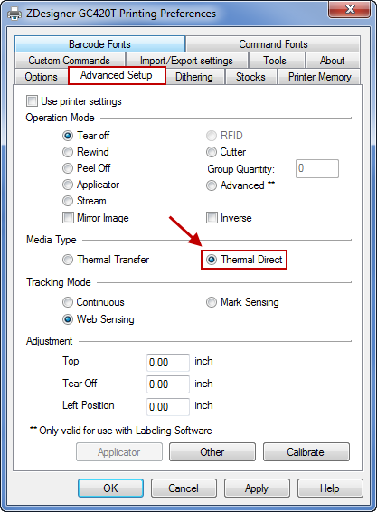

<h1 align="center"> Zebra Printers</h1>
 
Bulu uses the zebra printing technology to print GNC labels. All zebra printers use a Programming Language called (ZPL), which is a command-based language used by the printers as instructions to create the images printed on the labels [1]. Zebra painters use thermal technology to print, thus there is no need to replenish the printer.
 
## Features 
The following features are displayed in the zebra printer homepage [2].

## Version

The current printer zebra verison Bulu uses is ZT410 industrial Printer.

## Drivers

ZDesigner v. 8 Driver for Windows 
Driver version: 8.6.4.23832 
Recommended driver for use with ZebraDesigner 3. 
Supports current Zebra printers (ZPL printer command language/printers running Link-OS). 
OPERATING SYSTEM: Windows 10 (32 and 64 bit), Windows 11, Windows Server 2016, Windows Server 2022, Windows Server 2019 (64 bit)

## Calebrate
 There are two main methods to calebrage the zebra printer:
 
1. Automatic: Turning the zebra printer power swicth OFF and then ON again. The swicth is loactaed in the back of every prinetr. Once the printer is ON it will automatally calibate.

2. Manually:
 
## Configuration
1. Turn on the Zebra printer and connect the printer to your computer using the provided USB cord. 

2. Open Printers & Scanners on your Windows machine. The printer should be auto-detected within your Printers & Scanners. Rename the printer as desired. Set the Zebra printer as the default printer. The following is ZPL configuration prompt 
 

## References
 
1. https://github.com/SoftwareBulu/TechDocumentation/tree/main/ZPL
2. https://www.zebra.com/us/en/support-downloads/printers/industrial/zt410.html

<h5 align="center"> Copyright (C) 2022 by BuluBox. All rights reserved</h5>
